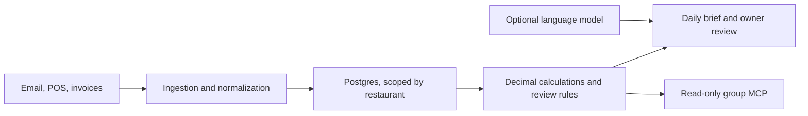

# Manager

**A daily operating brief for independent restaurant owners.** Manager turns
forwarded email, POS reports and supplier invoices into organized, traceable
figures for owner review. It works above the restaurant’s POS.

## What the system does



FastAPI accepts records and resolves restaurant identity server-side. Workers
classify and normalize incoming email, POS summaries and invoice fields;
reconciliation recovers email jobs from Postgres. Invoice totals and line
arithmetic use `Decimal`; incomplete or inconsistent extractions move to review.

Postgres stores tenant-scoped records. Code computes sales as numeric values
by restaurant business day. Optional model-written prose is checked against
those facts and falls back to a deterministic brief if validation fails. Group
views and MCP expose bounded read-only summaries after member and role checks.

## Engineering details

Tenant context is transaction-local and enforced by PostgreSQL row-level
security in API and worker paths. The core sales calculation is explicit:

```python
return self.gross_sales - self.discounts - self.comps - self.refunds
```

Selected implementation:

- Intake and normalization: [signed email event](src/app/resend_webhook.py), [email persistence](src/app/ingestion.py), [POS summary](src/app/sales_summary.py), [invoice extraction](src/app/ai/extraction.py) and [arithmetic checks](src/app/domain/invoices.py).
- Decision layer: [Decimal sales](src/app/domain/sales.py), [daily metrics](src/app/domain/metrics.py), [brief workflow](src/app/workers/workflows.py) and [numeric validation](src/app/domain/brief.py).
- Isolation and access: [tenant transaction code](src/app/db.py), [tenant RLS policy](src/migrations/versions/0001_foundation.py), [group RLS](src/migrations/versions/0025_group_integrations_mcp.py), [member guard](src/app/groups.py), [reconciliation](src/app/reconciler.py) and [read-only MCP](src/app/mcp_gateway.py).

These selected source excerpts originate from implementation revision
`d2de4a2db54da516e82821cfc18a7f1efa1fb012`; their original paths and hashes are
listed in [SOURCE-MANIFEST.json](src/SOURCE-MANIFEST.json). The repository is
MIT licensed; see [LICENSE](LICENSE).

## Product page


Manager product page on Mycellium Lab, captured 2026-10-05:
[mycelliumlab.com/manager/access](https://www.mycelliumlab.com/manager/access).
